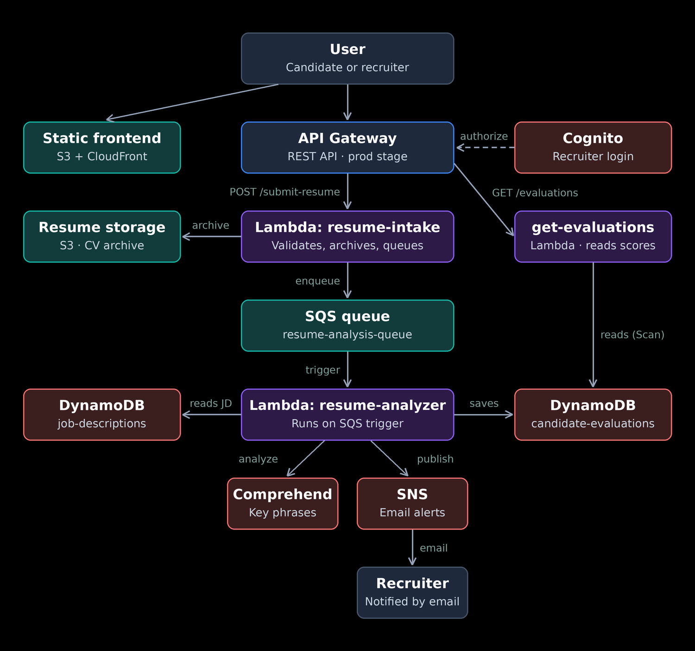
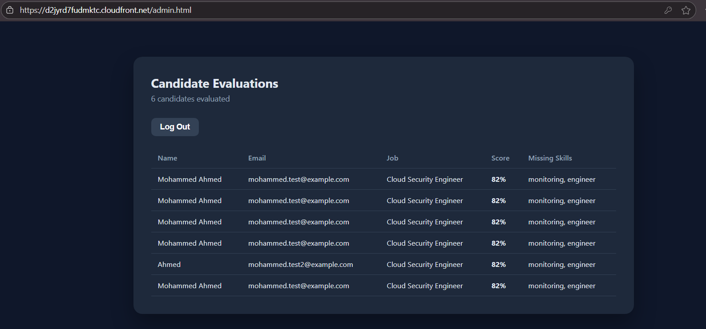

# 📊 Resume Analytics Platform — JD-Aligned Candidate Evaluation

> A serverless platform where candidates submit resumes and recruiters get AI-scored, ranked candidates against a job description — instead of manually reading every submission.

## Table of Contents
- [The Problem](#the-problem)
- [Architecture](#architecture)
- [Live Test Result](#live-test-result)
- [Skills Demonstrated](#skills-demonstrated)
- [Cost Decisions](#cost-decisions)
- [Possible Improvements](#possible-improvements)
- [Repository Structure](#repository-structure)

## The Problem

Screening resumes manually doesn't scale — a recruiter reading fifty submissions against one job description spends most of that time on candidates who were never a fit. This project automates the first pass: candidates submit through a public form, and every resume is scored against the actual job description before a recruiter ever opens it.

| Risk / Inefficiency | How this project handles it |
|---|---|
| Recruiter manually reading every resume | **Amazon Comprehend** extracts skills as key phrases and scores them against the job description automatically |
| Slow response for the submitting candidate | **SQS** decouples submission from analysis — the candidate gets an instant confirmation |
| Anyone being able to see candidate data | **Cognito** locks the recruiter dashboard behind real authentication |
| Losing track of *why* a candidate scored low | Missing skills are stored and shown alongside the score, not just a number |

## Architecture

| Layer | Service | Purpose |
|---|---|---|
| Frontend delivery | S3 (private) + CloudFront | Candidate form and recruiter dashboard, served over HTTPS via OAC |
| API | API Gateway (REST) | `POST /submit-resume` (public), `GET /evaluations` (Cognito-authorized) |
| Decoupling | SQS | Submission is queued instantly; scoring happens asynchronously |
| Compute | Lambda x3 (Python 3.12) | Resume intake, AI scoring, recruiter data retrieval |
| AI scoring | Amazon Comprehend | Key-phrase extraction used to match resume against job description |
| Storage | S3 | Archived copy of each submitted resume |
| Database | DynamoDB (x2 tables) | Job descriptions, and candidate evaluations with scores |
| Notifications | SNS | Emails the recruiter when a new candidate is scored |
| Authentication | Amazon Cognito | Real login for the recruiter dashboard (SPA app client) |

Region: `eu-north-1` (Comprehend calls target `eu-west-1`, since Comprehend isn't offered in `eu-north-1`)

## Live Test Result

Submitted a test resume against a stored job description. The candidate received an instant confirmation while scoring happened in the background; the recruiter dashboard then showed the candidate ranked by match score, with the specific missing skills listed alongside it.

## Skills Demonstrated

- Designing a two-sided platform (public submission + authenticated review) on one shared serverless backend
- Using Amazon Comprehend's key-phrase extraction as a matching signal, with a keyword-based fallback so the pipeline degrades gracefully instead of failing outright
- Decoupling submission from AI processing with SQS so candidate-facing latency stays low
- Structuring a two-table DynamoDB design (jobs vs. evaluations) instead of overloading a single table
- Protecting a recruiter-only API route with a Cognito authorizer, using the correct SPA app client type for browser-based auth
- Applying cross-region service-availability handling (Comprehend) learned from a prior project, rather than discovering it mid-build

## Cost Decisions

Every component here (S3, CloudFront, API Gateway, Lambda, SQS, DynamoDB, SNS, Cognito, and Comprehend at this call volume) has an always-free tier or near-zero cost. No component in this architecture bills by the hour regardless of usage, so nothing needs to be torn down between demos — unlike projects in this series that used WAF or EC2.

## Possible Improvements

- Replace the keyword-fallback matching with a Comprehend custom entity recognizer trained on real skill taxonomies
- Add a recruiter-facing endpoint to create/edit job descriptions instead of writing them directly into DynamoDB
- Support PDF resume uploads (via Textract for scanned files) instead of pasted plain text
- Add a Dead Letter Queue on the SQS queue to catch resumes that fail scoring repeatedly
- Move to Infrastructure as Code (Terraform) for repeatable deployment

## Repository Structure

    AWS-Resume-Analytics-Platform-Project/
    ├── README.md
    ├── STEPS.md              # Full step-by-step build log
    ├── CONCEPTS.md           # Design rationale for each decision
    ├── screenshots/
    ├── code/
    │   ├── lambda/
    │   │   ├── resume_intake/lambda_function.py
    │   │   ├── resume_analyzer/lambda_function.py
    │   │   └── get_evaluations/lambda_function.py
    │   └── frontend/
    │       ├── index.html
    │       ├── admin.html
    │       ├── style.css
    │       ├── script.js
    │       └── admin.js
    └── iam/resume-platform-lambda-policy.json
