<div align="center">

# 🛠️ Build Log — Resume Analytics Platform

A record of the resources created and the configuration used to build the resume-scoring workflow.


</div>

---

### Contents
- 🗃️ [DynamoDB Tables](#dynamodb)
- 📬 [SQS Queue](#sqs)
- 📣 [SNS Topic](#sns)
- 🔑 [Cognito User Pool](#cognito)
- 🔐 [IAM Role & Policy](#iam)
- 🪣 [S3 Bucket — Resume Storage](#s3-storage)
- ⚡ [Lambda — resume-intake](#lambda-intake)
- ⚡ [Lambda — resume-analyzer](#lambda-analyzer)
- ⚡ [Lambda — get-evaluations](#lambda-getevals)
- 🔌 [API Gateway](#api-gateway)
- 🌍 [S3 + CloudFront (Frontend)](#frontend)
- ✅ [End-to-End Test](#e2e-test)

---

<a id="dynamodb"></a>
## 🗃️ DynamoDB Tables

Two separate tables — one for job descriptions, one for candidate results — instead of overloading a single table with two different kinds of records.

| Table | Partition key | Purpose |
|:---|:---|:---|
| `job-descriptions` | `job_id` (String) | Stores each job's title and description text |
| `candidate-evaluations` | `candidate_id` (String) | Stores each candidate's score and missing skills |

Both use On-demand capacity mode.

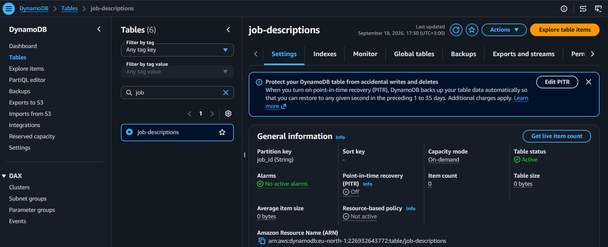
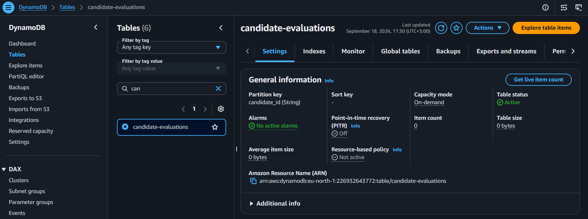

---

<a id="sqs"></a>
## 📬 SQS Queue

Lets the candidate get an instant confirmation, instead of waiting for the AI scoring to finish first.

| Setting | Value |
|:---|:---|
| Name | `resume-analysis-queue` |
| Type | Standard |
| Visibility timeout | 60 seconds |

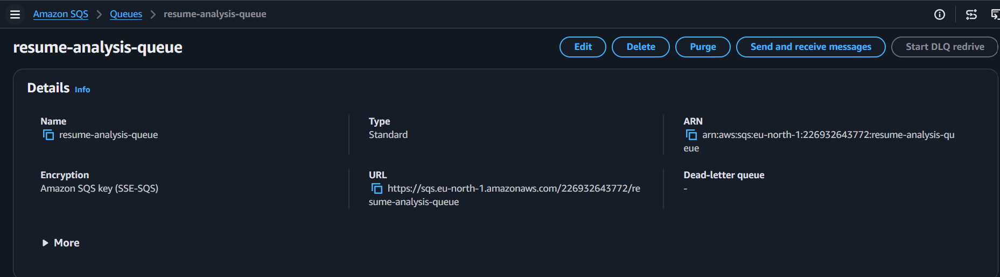

---

<a id="sns"></a>
## 📣 SNS Topic

Notifies the recruiter every time a new candidate finishes scoring.

| Setting | Value |
|:---|:---|
| Topic name | `evaluation-notifications` |
| Type | Standard |
| Subscription | Email, confirmed |

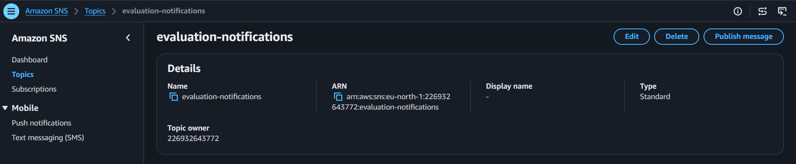

---

<a id="cognito"></a>
## 🔑 Cognito User Pool

Real login for the recruiter dashboard.

| Setting | Value |
|:---|:---|
| Pool name | `recruiter-auth-pool` |
| Application type | Single-page application (SPA) |
| Recruiter user | Created manually in the Users tab |

The app client is created as SPA from the start — this type carries no Client Secret, which browser-side JavaScript needs since it has nowhere secure to hold one.

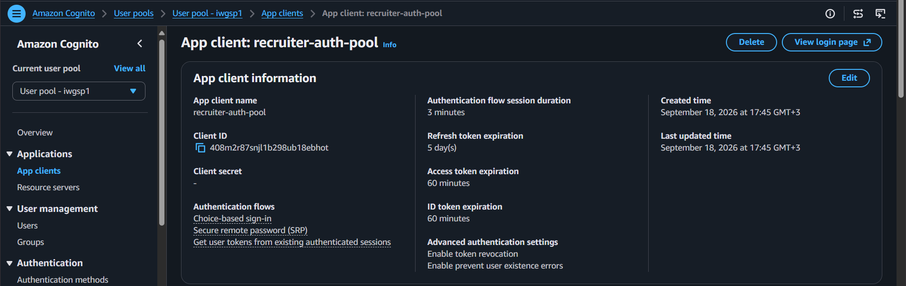
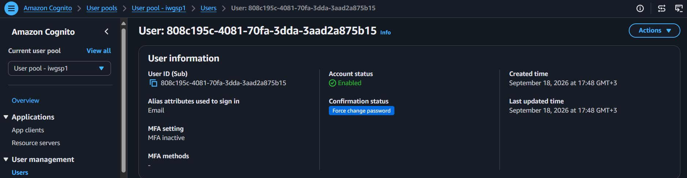

---

<a id="iam"></a>
## 🔐 IAM Role & Policy

Scoped to exactly what the three Lambda functions use — both DynamoDB tables, the specific S3 bucket, the specific queue, and only the two Comprehend actions actually called.

```json
{
  "Version": "2012-10-17",
  "Statement": [
    {
      "Effect": "Allow",
      "Action": ["logs:CreateLogGroup", "logs:CreateLogStream", "logs:PutLogEvents"],
      "Resource": "*"
    },
    {
      "Effect": "Allow",
      "Action": ["s3:PutObject", "s3:GetObject"],
      "Resource": "arn:aws:s3:::resume-storage-*/*"
    },
    {
      "Effect": "Allow",
      "Action": ["sqs:SendMessage", "sqs:ReceiveMessage", "sqs:DeleteMessage", "sqs:GetQueueAttributes"],
      "Resource": "arn:aws:sqs:*:*:resume-analysis-queue"
    },
    {
      "Effect": "Allow",
      "Action": ["dynamodb:PutItem", "dynamodb:GetItem", "dynamodb:Scan", "dynamodb:UpdateItem"],
      "Resource": [
        "arn:aws:dynamodb:*:*:table/job-descriptions",
        "arn:aws:dynamodb:*:*:table/candidate-evaluations"
      ]
    },
    {
      "Effect": "Allow",
      "Action": "sns:Publish",
      "Resource": "*"
    },
    {
      "Effect": "Allow",
      "Action": "comprehend:DetectKeyPhrases",
      "Resource": "*"
    }
  ]
}
```

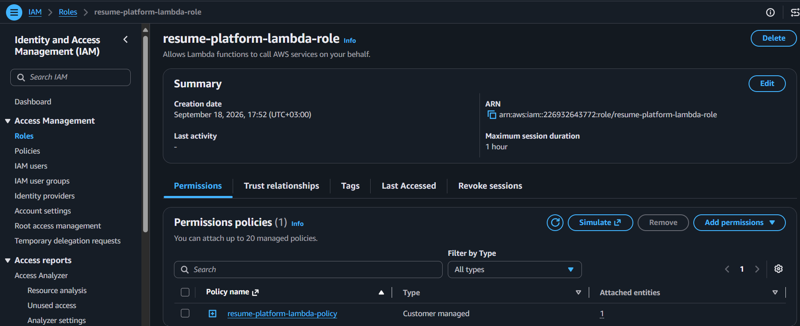

---

<a id="s3-storage"></a>
## 🪣 S3 Bucket — Resume Storage

Keeps an archived copy of every submitted resume, fully private.

| Setting | Value |
|:---|:---|
| Name | `resume-storage-<account-id>` |
| Block all public access | On |

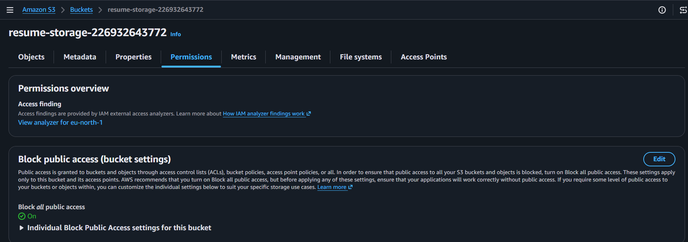

---

<a id="lambda-intake"></a>
## ⚡ Lambda — resume-intake

Validates the submission, archives the resume to S3, and queues it for scoring.

| Setting | Value |
|:---|:---|
| Name | `resume-intake` |
| Runtime | Python 3.12 |
| Env vars | `QUEUE_URL`, `BUCKET_NAME`, `ALLOWED_ORIGIN` |
| Timeout | 15 sec |

Full code: [`code/lambda/resume_intake/lambda_function.py`](code/lambda/resume_intake/lambda_function.py)

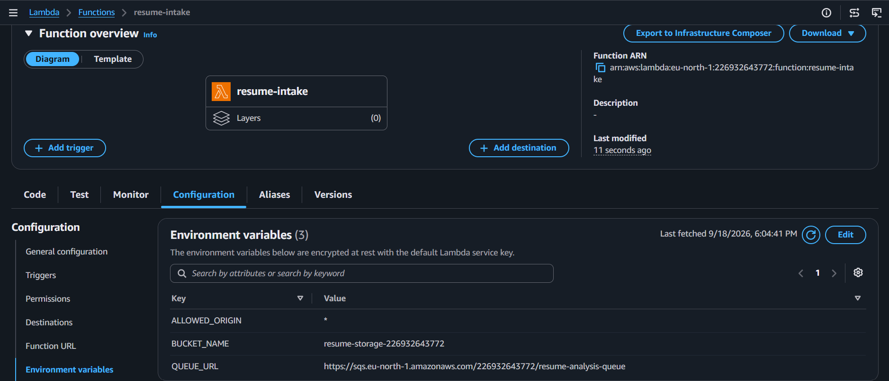

---

<a id="lambda-analyzer"></a>
## ⚡ Lambda — resume-analyzer

Triggered by SQS. Extracts key phrases from both the job description and the resume via Comprehend, computes a match score, stores it, and notifies the recruiter.

| Setting | Value |
|:---|:---|
| Name | `resume-analyzer` |
| Runtime | Python 3.12 |
| Env vars | `TABLE_NAME` (candidate-evaluations), `JOBS_TABLE_NAME`, `TOPIC_ARN` |
| Trigger | SQS — `resume-analysis-queue` |
| Timeout | 30 sec |

> **Region:** Comprehend isn't available in `eu-north-1`, so the client explicitly targets `eu-west-1`:
> ```python
> comprehend = boto3.client("comprehend", region_name="eu-west-1")
> ```

> **Resilience:** key-phrase extraction has a fallback — if Comprehend is unavailable, it drops to a simple keyword extractor instead of failing the whole function. Scoring still works, just with less linguistic precision until Comprehend responds again.

Full code: [`code/lambda/resume_analyzer/lambda_function.py`](code/lambda/resume_analyzer/lambda_function.py)

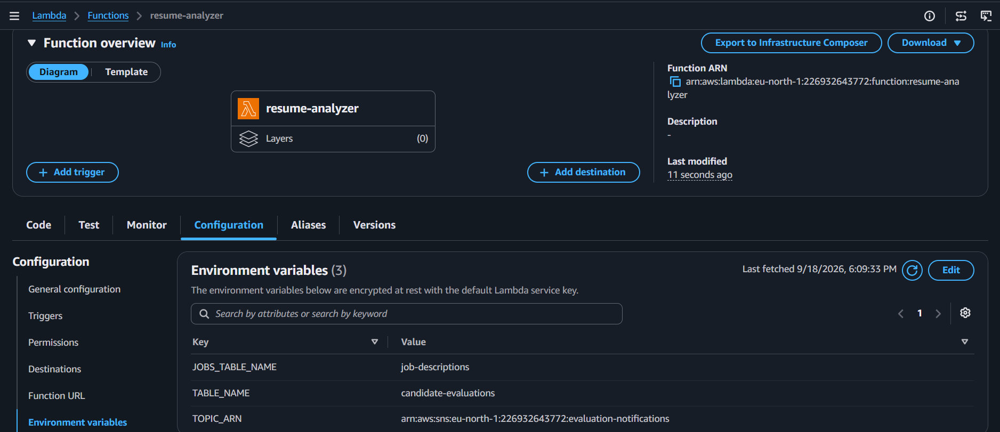
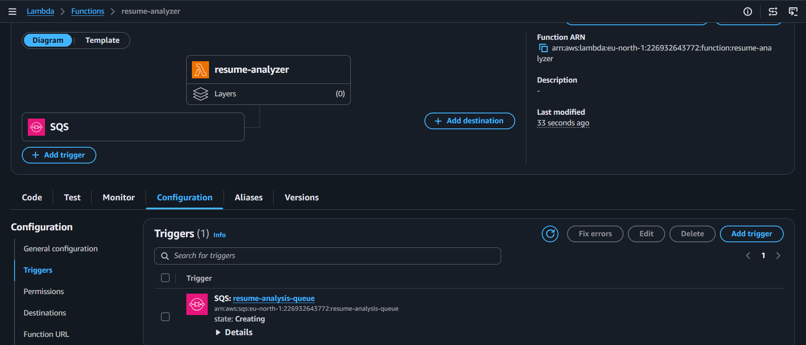

---

<a id="lambda-getevals"></a>
## ⚡ Lambda — get-evaluations

Returns every candidate, ranked by match score, to the authenticated recruiter dashboard. Supports an optional `job_id` filter.

| Setting | Value |
|:---|:---|
| Name | `get-evaluations` |
| Runtime | Python 3.12 |
| Env vars | `TABLE_NAME`, `ALLOWED_ORIGIN` |

Full code: [`code/lambda/get_evaluations/lambda_function.py`](code/lambda/get_evaluations/lambda_function.py)

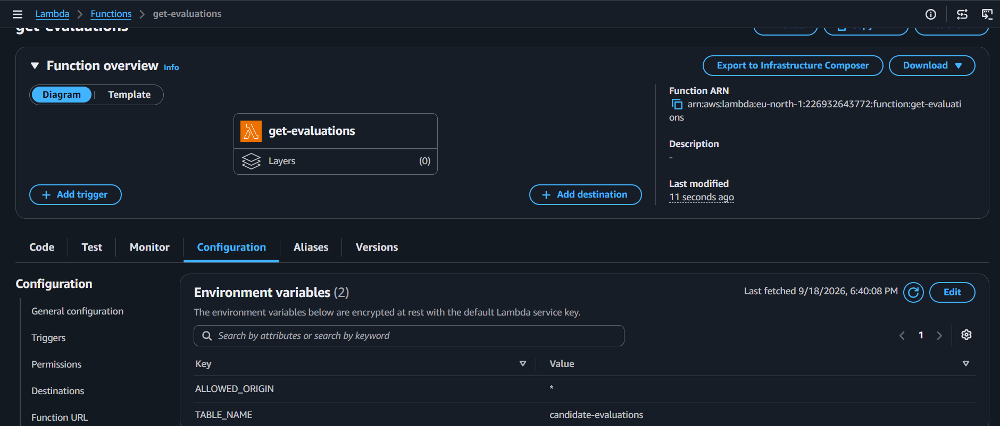

**Test job:** there's no dedicated endpoint for creating jobs in this version, so a job is added directly in DynamoDB for testing — `job_id: cloud-security-01`, with a `title` and a short `jd_text`.

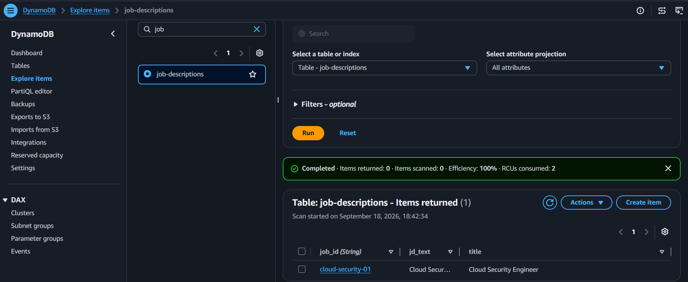

---

<a id="api-gateway"></a>
## 🔌 API Gateway

Connects the frontend to all three Lambda functions, with the recruiter route protected by Cognito.

| Route | Access | Target |
|:---|:---|:---|
| `POST /submit-resume` | Public | `resume-intake` |
| `GET /evaluations` | Cognito-protected | `get-evaluations` |

API: `resume-evaluation-api` (REST, Regional) · Stage: `prod`

> **CORS has two places that must agree:** the `ALLOWED_ORIGIN` environment variable inside each Lambda, and the `Access-Control-Allow-Origin` header on API Gateway's own OPTIONS method response. Both must match exactly (`https://`, no trailing `/`), and any API Gateway change needs a fresh **Deploy API → prod** to take effect.

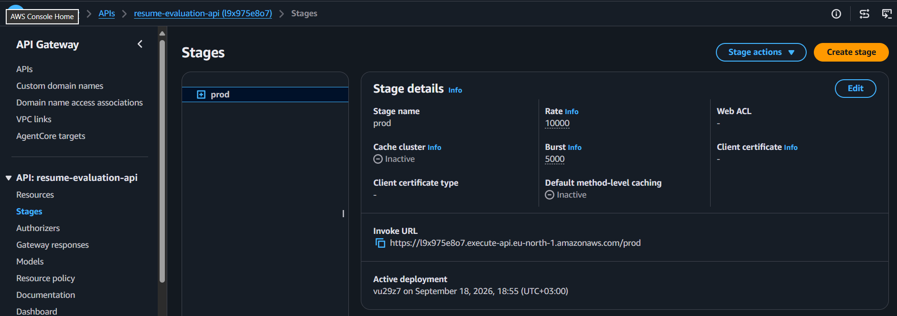
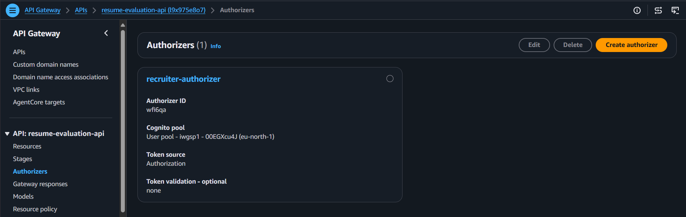

---

<a id="frontend"></a>
## 🌍 S3 + CloudFront (Frontend)

Hosts both the candidate submission form and the recruiter dashboard from a fully private bucket.

| Setting | Value |
|:---|:---|
| Frontend bucket | `resume-platform-frontend-<account-id>`, public access blocked |
| Files | `index.html`, `admin.html`, `style.css`, `script.js`, `admin.js` |
| CloudFront origin | The frontend S3 bucket |
| Private S3 access | Enabled — sets up Origin Access Control (OAC) automatically |
| Viewer protocol policy | Redirect HTTP to HTTPS |
| Allowed HTTP methods | GET, HEAD |
| Security protections | Not enabled |

The generated bucket policy from the CloudFront setup banner is applied directly to the S3 bucket policy, scoping read access to CloudFront/OAC only.

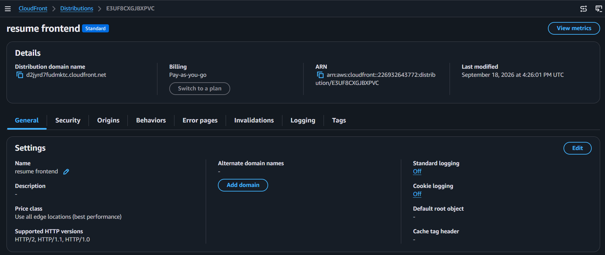
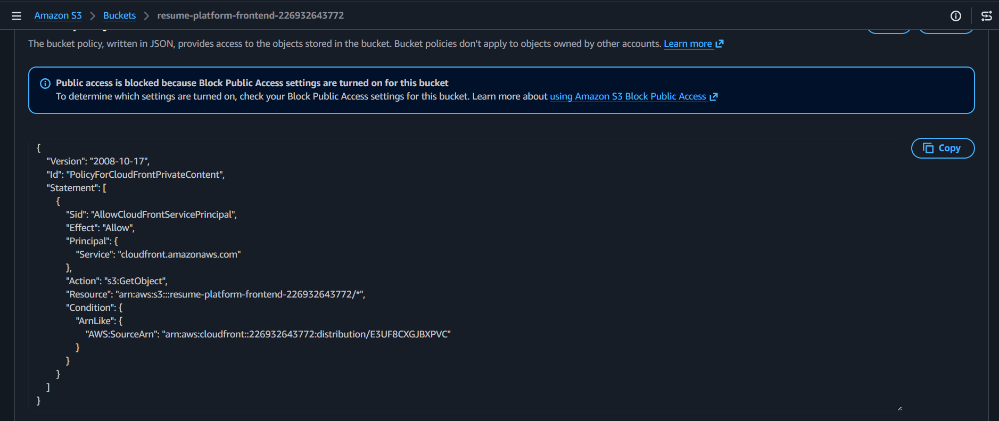

---

<a id="e2e-test"></a>
## ✅ End-to-End Test

`ALLOWED_ORIGIN` updated on both public-facing Lambdas to the real CloudFront domain, then tested candidate submission against `job_id: cloud-security-01` and the recruiter dashboard login.

| Check | Result |
|:---|:---:|
| Resume submission → instant confirmation | ✅ |
| Async scoring via SQS + Comprehend | ✅ |
| Recruiter notification email | ✅ |
| Dashboard shows ranked candidates | ✅ |

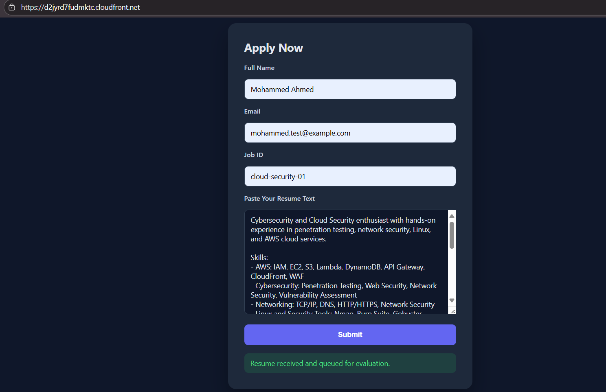

